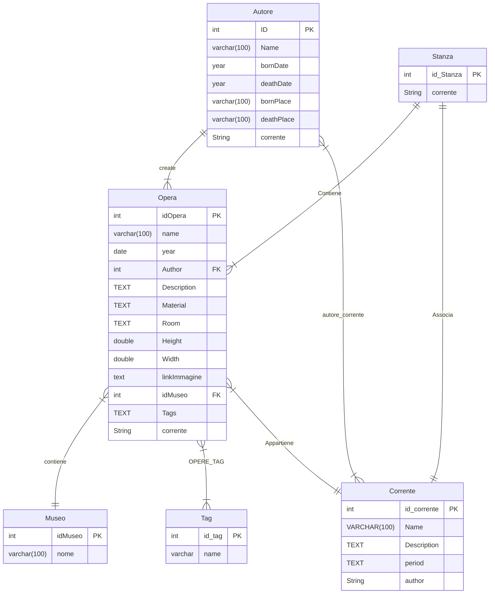

# Analisi

Questa parte del progetto si occupa della gestione dell'inventario dei museo, permette di avere un catalogo completo di tutte le opere presenti all'interno di un museo, filtrabili per molteplici attributi, quali:
- Anno di creazione
- Autore
- Tecnica di pittura
- Corrente
- Nationalita' autore
- Posizione nel museo

 
 

# Database

