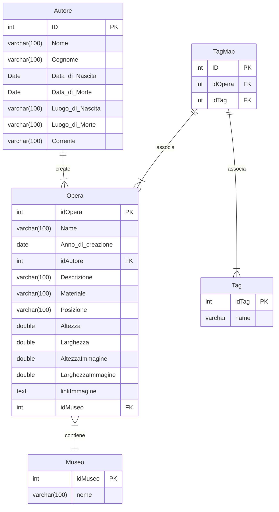

# Analisi

Questa parte del progetto si occupa della gestione dell'inventario dei museo, permette di avere un catalogo completo di tutte le opere presenti all'interno di un museo, filtrabili per molteplici attributi, quali:
- Anno di creazione
- Autore
- Tecnica di pittura
- Corrente
- Nationalita' autore
- Posizione nel museo
- Se in prestito

 
 

# Classi
Ogni opera avra' i seguenti attributi:
- Titolo
- Anno di creazione
- Autore
- Descrizione
- Materiale/Tecnica
- Posizione all'interno del museo
- Museo di appartenenza
- Altezza
- Larghezza
- Tag

Ogni Autore avra' i seguenti attributi:
- Nome Cognome
- Data di nascita
- Luogo di nascita
- Data di morte
- Luogo di morte
- Nazionalita'
- Corrente

Museo classe singleton:
- Lista posizioni

# Database

